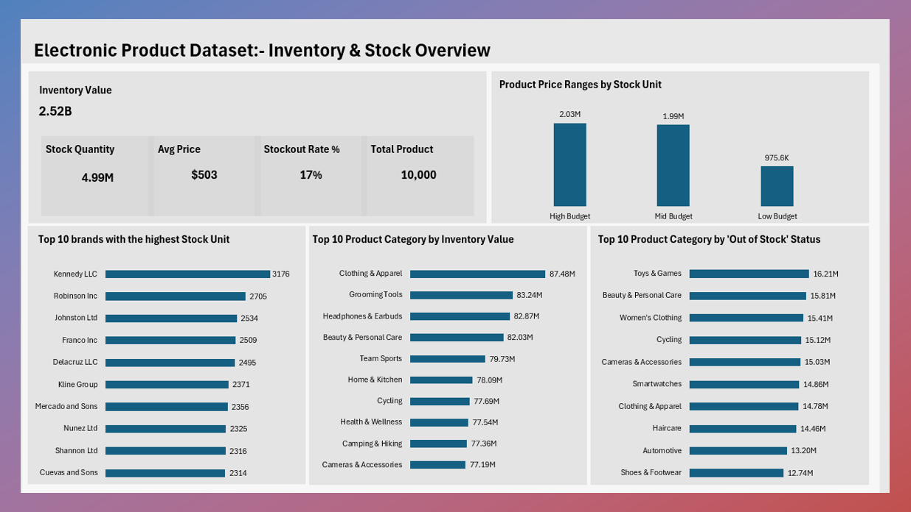
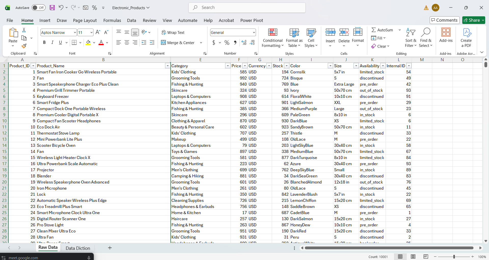
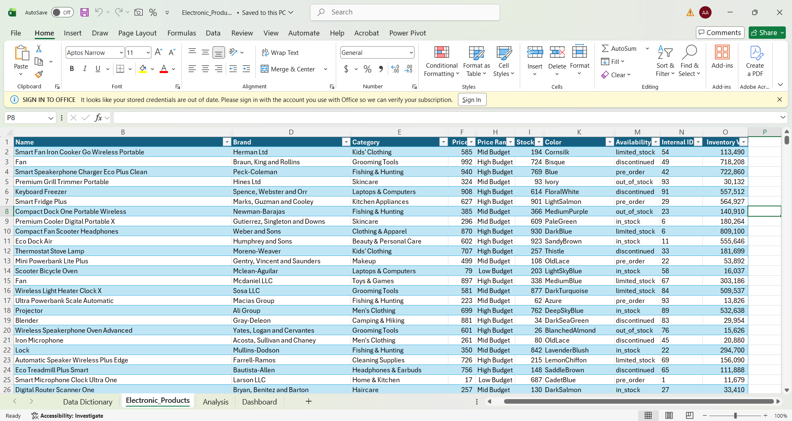
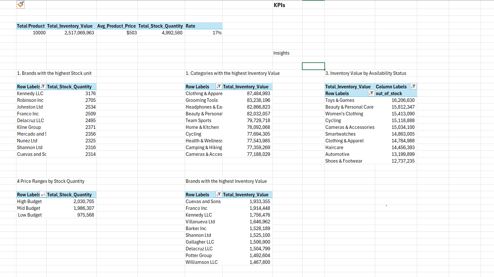
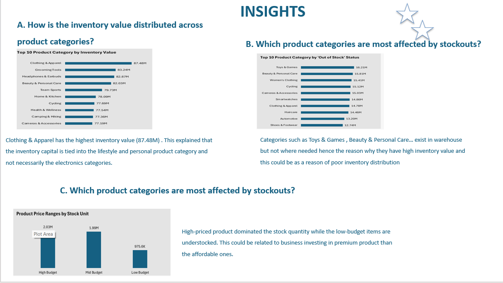

# ELECTRONIC-PRODUCT-DATASET-INVENTORY-AND-STOCK-ANALYSIS

I recently worked on an inventory dataset and uncovered some interesting insights that go beyond just numbers.
## Dataset Overview:
This wasn't a sales dataset, it focused on product inventory, stock levels, pricing, and brand distribution.
The dataset contains information about an electronic products inventory, focusing on product details, stock levels, and availability status. Each row represents a unique product within the inventory system.
The dataset consists of 10000 records with key columns such as: product name, brand, category, price, stock quantity, and availability status. Additional fields such as internal ID and EAN serve as unique identifiers for each product.
The goal was to understand how businesses can better manage their products and make smarter decisions.
Dataset Observations:
The dataset contains a mix of product attributes and inventory metrics.
It is limited because it does not include sales, time-based, or customer data, making it unsuitable for revenue or trend analysis.
Availability statuses which could be a red flag for a business.
Products are categorized across different brands and categories

## Data Preparation:
Before diving into the analysis, I ensured the dataset was clean, structured, and ready for insights:
- Converted the dataset into a structured table format using Ctrl + T for better data handling
- Reviewed and standardized column names for clarity and consistency
- Corrected data types to ensure accurate analysis (e.g., numeric, text)
- Created a helper column to segment products into price ranges (Low-budget, Mid-budget, High-budget)
- Derived a new metric "Inventory Value (Stock × Price)" to measure the total value of products in stock
  

### Key Questions:
- Which product categories hold the highest stock?
- How do price ranges influence quantity in stock?
- Which brands contribute the most to total inventory value?
- Are there products marked "out of stock" but still holding inventory value?
  

## Key Insights:
• Clothing & Apparel has the highest inventory value (87.48M) . This explained that the inventory capital is tied into the lifestyle and personal product category and not necessarily the electronics categories.
* Categories such as Toys & Games , Beauty & Personal Care… exist in warehouse but not where needed hence the reason why they have high inventory value and this could be as a reason of poor inventory distribution.
* High-priced product dominated the stock quantity while the low-budget items are understocked. This could be related to business investing in premium product than the affordable ones.

## What This Means:
Inventory is not just about availability, it's about balance. Overstocking ties down capital, while inconsistencies in stock status can mislead decision-making.
## Recommendations:
* Inventory Allocation should be fixed, stocks should be redistributed to various channels, and a survey should be done on product that's is being demanded most to avoid Overstocked and Understock of product.
* A Balanced Pricing Strategy should be enforced i.e. increase low-priced product and have a balanced stock level for the moderate-product should have high availability rate. This action will control high price inventory
* An Implementation of a demand - driven Inventory allocation system should be enforced either by checking the historical pattern. This will help to reduce stockout and improve product availability.
* Prioritize restocking out of stock products, by this it will reduce missed sales and helps maintain good customer satisfaction.
There should a diversify and brand supplier strategy, this will also the stakeholder find alternative brands rather than relying too much on the top 3 suppliers. This helps to have a better pricing and reduce supply risk.

## Tools Used:
* Power Query 
* Excel
